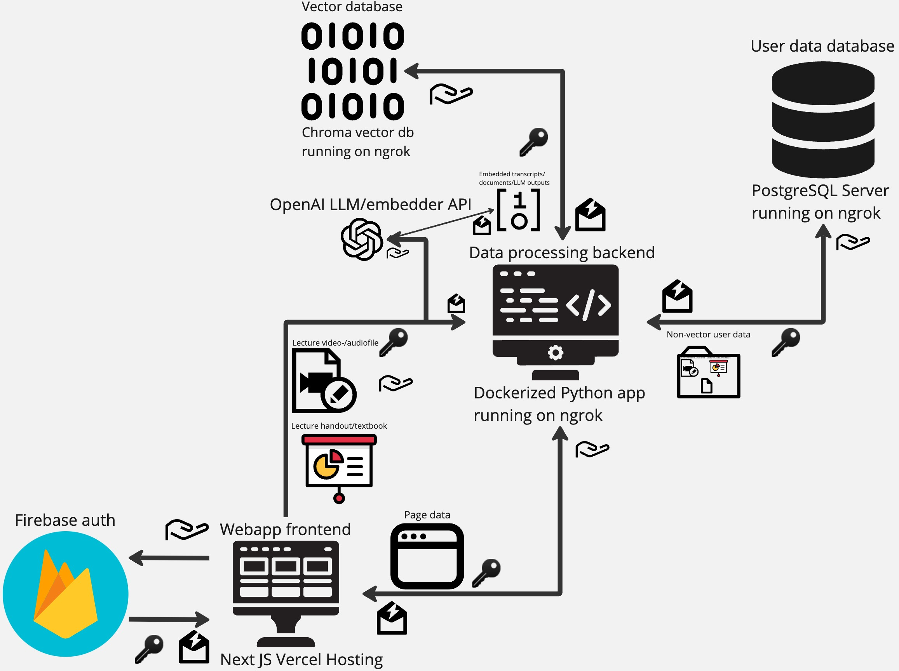

# c-team

## Team name

ClinEd

## Members

- Abiy M Abahoy - developer
- Leo Ren - developer 
- Daniel Meilech - PM 
- Easha Kaur Dhillon - Prod 

## Mission statement 

Addressing the challenges of accessibility and efficiency in medical education to enhance learning outcomes and support the needs of medical students.

## Problem Statement
The COVID-19 pandemic exposed an alarming deficit in the healthcare industry – the critical lack of healthcare workers. This understaffing crisis existed before the pandemic and continues to persist. A primary contributing factor is the formidable challenge of medical school, a daunting path that deters many prospective students. 

Medical education is notoriously strenuous and competitive, potentially dissuading many aspirants. For the 2022-2023 matriculants, the average cumulative GPA and MCAT score were 3.75 and 511.9, respectively, as noted by Dr. Shemmassian [1]. This high barrier to entry, coupled with the dearth of effective study tools, produces an arduous journey for students. Existing study resources, encompassing websites and video materials, tend to either broadly cover topics, failing to provide course-specific content, or hyper-focus on specific concepts, leaving gaps in knowledge. 

Addressing this disparity could provide students with much-needed consistency and organization, lightening their academic load. However, the impact of this issue extends beyond students. The healthcare system continues to reel from the effects of the pandemic, exacerbated by a workforce shortage. Medical professionals faced unprecedented levels of stress during the pandemic, with shifts often lasting more than half a day to cater to the influx of patients. As a result, about 3 in 10 healthcare workers considered leaving their profession according to a Kaiser Family Foundation/Washington Post poll [2]. Enhancing the educational experience could potentially reduce these stress levels, providing a more sustainable solution for the healthcare sector.

1. Shemmassian, Dr. “How Hard Is It to Get into Medical School? (2023).” Shemmassian Academic Consulting, 7 Feb. 2023, www.shemmassianconsulting.com/blog/how-hard-is-it-to-get-into-medical-school.
2. “Data Brief: Health Care Workforce Challenges Threaten Hospitals’ Ability to Care for Patients: AHA.” American Hospital Association, 30 Oct. 2021, www.aha.org/fact-sheets/2021-11-01-data-brief-health-care-workforce-challenges-threaten-hospitals-ability-care.

## Solution Summary
In light of the above challenges, our web application is designed to specifically address the hurdles faced by students in the healthcare field. We aim to increase the accessibility and efficiency of medical education and consequently enhance learning outcomes. By developing a user-friendly platform, our solution empowers students to create personalized courses, upload study materials, and generate comprehensive study guides and study cards. 

Our interactive approach facilitates efficient knowledge acquisition, fostering a personalized learning experience, and promoting active student engagement. Moreover, our web application enables students to access these resources from anywhere at any time, thus overcoming geographical barriers and maximizing their study time. By equipping them with these advanced tools, our solution paves the way for healthcare students to excel in their academic journey, reinforce their understanding, and confidently navigate the intricacies of their chosen profession.

## Frontend
Our application comprises several pages, each with unique functionalities:

### Home Page

This page serves as the user's dashboard, showcasing the courses they have created, along with recommendations for public courses created by others. Users can search for courses in their library and in the public domain, categorized by topic through semantic search (We’ll talk more about this later but processed user materials are stored in a vector database). 

Courses act as directories for storing lecture and class materials. To start using our study tools, a user must create a course or search for a publicly available one.

### Course Page

This is a course page. On the left side of the page a short course summary is presented by our system’s analysis of the course material and the user can choose to set a profile image for it, as well as name it however they like. 

On the right hand side are the course materials uploaded by the user + a study guide. Each Lecture basically acts as a sub-directory, where users and our system store information about that specific lecture; the study guide is a page where our system recommends a learning schedule to our user based on materials and the syllabus uploaded (we’ve defined that as a stretch goal for now so we don’t have a wireframe of it); 

text books is a sub-directory of all text book materials uploaded by our users and the materials our system creates from them - it practically contains the same information as a Lecture or a Handout summary (we’ll discuss them later)

### Lecture Page

This is a lecture page. On the left side of the page we display the original materials uploaded by the user - lecture video/audio and or lecture handouts, a full lecture transcript is also displayed for user’s convenience (even if they didn’t upload it originally.) 

We’ll be accepting a variety of files here .wav, .mp4a, .mp3 and so on for audio recordings of lectures/ .mp4, .avi and so on for video recordings of lectures, and .pdf, .doc, .txt and so on for lecture handout documents/lecture transcripts if they user decides to provide those themselves. 

On the right side of the page we display the materials generated by our system from user data - a lecture summary that’s composed by a Large Language Model (LLM) agent from the lecture transcript (that’s generated by a transformer-based encoder-decoder speech recognition model) we’ll show how that will look on a separate page; a handout summary, pretty much the same thing but using Layout Parser Computer Vision. 

### Summary Page

This is a summary page, it will be pretty much the same for lecture/handout/textbook summaries. On the left side of the page there will be an interactive table of contents that will allow the users to easily navigate through the material. On the right side is the LLM-compiled summary. The summaries will include relevant diagrams from handouts and textbooks. Assembly of summaries will be described in the backend section. 

### Study Card Pages

These are study card pages. Study cards are available in three views: card, list, and study. The card view allows users to flip through study cards one by one. The list view enables users to scroll through the entire list of study cards for a given lecture. The study view shuffles the definitions for terms, creating a test and allowing users to gauge their knowledge. All cards are also generated by a LLM agent, but users can edit terms and definitions and star them for inclusion in the study guide.

## Backend

This is a data diagram of our application. The hand symbol stands for request, the key for authorization token, the envelope with a lightning - response. In order to interact with our applications users will need to register, once they do their account will be issued an authorization token stored in the firebase database - this authorization token will be used as user ID in all other parts of the application. From the application website the client will be making requests to store and process user data, and a request for displaying page data. There’s a lot of moving parts to the data processing backend. 

For the purposes of this class we'll be using OpenAI’s API for LLM agents, and embeddings (which also adds potential external error states from the API.) However, in a real-world scenario we’d be using an open source LLM instead (such as Falcon-40b) because OpenAI’s pricing makes it financially unfeasible to use their models for processing large amounts of data. The data processing backend includes the following agents: labeling LLM agent, summarizing LLM agent, table of contents LLM agent, key term LLM agent, Layout Parser agent, embedding agent, encoder-decoder speech recognition agent; it also includes functions to send data to the frontend, vector and user databases and helper functions for file conversion. All of it will run as a dockerized Python application locally hosted on our personal server made public via ngrok.

The encoder-decoder speech recognition agent receives a lecture video/audiofile and converts it into a full text transcript. The Layout Parser agent uses OCR and layout/table/object detection to extract image and text information from lecture handouts and textbooks. The summarizing LLM agent accepts text data from encoder-decoder and Layout Parser agents and converts it into more concise text while keeping track of its data origin. The labeling LLM agent accepts summaries from the summarizing agent and outputs even more concise labels for each of them while keeping track of data origin. The table of contents LLM agent accepts a list of labels for a given document and outputs a table of contents based on it. The key term LLM agent accepts summaries from the summarizing agent and outputs study cards for the key terms contained within them. The embedding agent accepts data from all the LLM agents and converts it into vector format while retaining the data origin for storage in the vector database. 

The vector database stores embeddings allowing to perform vector operations (such as semantic search over user data), it organizes all of the LLM-generated data allowing it to be served to the frontend in the form of summaries and study cards. For the purposes of this class the local vector database Chroma will be used (hosted via ngrok), in a real-world scenario a cloud database like Pinecone would be used. 

The user data database stores all non-vector user data, raw files of handouts/textbooks/lecture recordings and user interactions with the application, it also records state data e.g. whereas uploaded materials are made public or kept private by the user. The user data database will be a Postgresql server (hosted via ngrok). 

Error states of the application will be the standard HTTP request error states i.e. 4xx for frontend failures; 5xx for backend/database/OpenAI API failures. The service will try to utilize asynchronous requests and LLM agent concurrency to try to accommodate said error states (e.g. if a Layout Parser agent fails, encoder-decoder/summarizing/labeling/key term agents will proceed with the lecture summary without providing a handout one) 

The backend will utilize Python TensorFlow and Llangchain, the frontend will utilize the NextJS framework and will be hosted on free-tier Vercel. 